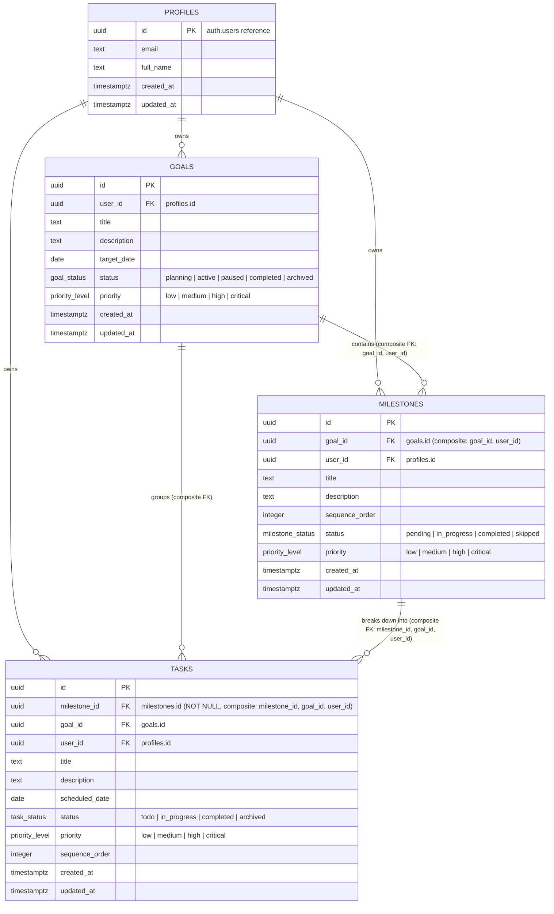

# Database Review & Entity Relationship Diagram (ERD) — Stride

> **Status:** Active Baseline Specification (v0.1)  
> **Audience:** Core Architects, Database Administrators, AI Execution Agents

---

## 1. Entity Relationship Diagram (Mermaid)

---

## 2. Entity Specifications & Composite Cardinality

### 2.1 `profiles`
- **Description**: Stores user profile details synced directly from Supabase Auth (`auth.users`).
- **Primary Key**: `id` (UUID, references `auth.users(id)` ON DELETE CASCADE).

### 2.2 `goals`
- **Description**: High-level ambitious objectives set by the user.
- **Primary Key**: `id` (UUID, default `gen_random_uuid()`).
- **Foreign Keys**: `user_id` $\rightarrow$ `profiles.id` (ON DELETE CASCADE).
- **Composite Unique Constraint**: `(id, user_id)` — ensures child milestones and tasks strictly belong to the same user hierarchy.

### 2.3 `milestones`
- **Description**: Phased roadmap stages generated by AI or defined by the user.
- **Primary Key**: `id` (UUID, default `gen_random_uuid()`).
- **Composite Foreign Key**: `(goal_id, user_id)` $\rightarrow$ `goals(id, user_id)` (ON DELETE CASCADE).
- **Composite Unique Constraint**: `(id, goal_id, user_id)` — ensures child tasks strictly match parent milestone, goal, and user hierarchy.

### 2.4 `tasks`
- **Description**: Actionable, discrete work items scheduled for execution.
- **Primary Key**: `id` (UUID, default `gen_random_uuid()`).
- **Mandatory Foreign Keys**:
  - `milestone_id` (UUID NOT NULL)
  - `goal_id` (UUID NOT NULL)
  - `user_id` (UUID NOT NULL)
- **Composite Foreign Key**: `(milestone_id, goal_id, user_id)` $\rightarrow$ `milestones(id, goal_id, user_id)` (ON DELETE CASCADE).
- **Attributes**: `sequence_order` (INT NOT NULL DEFAULT 1) — represents task position within its milestone.

---

## 3. Active Performance Indexes

1. **`idx_goals_user_status`**: `(user_id, status)`
2. **`idx_milestones_goal_seq`**: `(goal_id, sequence_order)`
3. **`idx_milestones_goal_user`**: `(goal_id, user_id)`
4. **`idx_tasks_user_scheduled`**: `(user_id, scheduled_date, status)`
5. **`idx_tasks_milestone_hierarchy`**: `(milestone_id, goal_id, user_id)`
6. **`idx_tasks_milestone_seq`**: `(milestone_id, sequence_order)`
7. **`idx_tasks_goal_id`**: `(goal_id)`
8. **`idx_tasks_milestone_id`**: `(milestone_id)`
