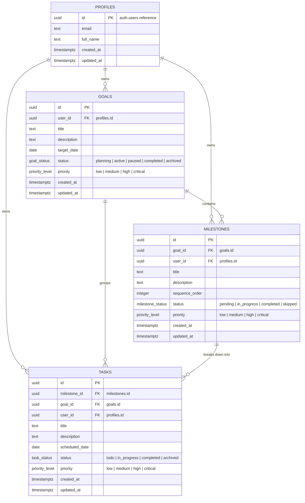

# Database Review & Entity Relationship Diagram (ERD) — Stride

> **Status:** Review Phase (Pending Approval)  
> **Audience:** Core Architects, Database Administrators, AI Execution Agents

---

## 1. Entity Relationship Diagram (Mermaid)

---

## 2. Entity Specifications & Cardinality

### 2.1 `profiles`
- **Description**: Stores user profile details synced directly from Supabase Auth (`auth.users`).
- **Primary Key**: `id` (UUID, references `auth.users(id)` ON DELETE CASCADE).
- **Relationships**:
  - `1 : N` with `goals` (One user can have multiple goals).
  - `1 : N` with `milestones` (One user owns all associated milestones).
  - `1 : N` with `tasks` (One user owns all daily action tasks).

### 2.2 `goals`
- **Description**: High-level ambitious objectives set by the user.
- **Primary Key**: `id` (UUID, default `gen_random_uuid()`).
- **Foreign Keys**: `user_id` $\rightarrow$ `profiles.id` (ON DELETE CASCADE).
- **Attributes**: `title`, `description`, `target_date`, `status` (`goal_status`), `priority` (`priority_level`).
- **Relationships**:
  - `1 : N` with `milestones` (A goal decomposes into an ordered sequence of milestones).
  - `1 : N` with `tasks` (A goal groups all child tasks for query denormalization).

### 2.3 `milestones`
- **Description**: Phased roadmap stages generated by AI or defined by the user.
- **Primary Key**: `id` (UUID, default `gen_random_uuid()`).
- **Foreign Keys**:
  - `goal_id` $\rightarrow$ `goals.id` (ON DELETE CASCADE).
  - `user_id` $\rightarrow$ `profiles.id` (ON DELETE CASCADE).
- **Attributes**: `title`, `description`, `sequence_order` (INT), `status` (`milestone_status`), `priority` (`priority_level`).
- **Relationships**:
  - `1 : N` with `tasks` (A milestone breaks down into discrete daily actionable tasks).

### 2.4 `tasks`
- **Description**: Actionable, discrete work items scheduled for execution.
- **Primary Key**: `id` (UUID, default `gen_random_uuid()`).
- **Foreign Keys**:
  - `milestone_id` $\rightarrow$ `milestones.id` (ON DELETE CASCADE, optional/nullable for orphan tasks).
  - `goal_id` $\rightarrow$ `goals.id` (ON DELETE CASCADE).
  - `user_id` $\rightarrow$ `profiles.id` (ON DELETE CASCADE).
- **Attributes**: `title`, `description`, `scheduled_date` (DATE, default `CURRENT_DATE`), `status` (`task_status`), `priority` (`priority_level`).

---

## 3. Recommended Performance Indexes

To ensure high speed as data grows, the following PostgreSQL indexes are recommended:

1. **`idx_goals_user_status`**: `(user_id, status)`
   - *Query target*: Fetching active goals for a specific user during daily execution plan generation.
2. **`idx_milestones_goal_seq`**: `(goal_id, sequence_order)`
   - *Query target*: Fetching roadmap milestones in sequential order for a specific goal.
3. **`idx_tasks_user_scheduled`**: `(user_id, scheduled_date, status)`
   - *Query target*: Rendering "Today's Action Plan" dashboard view instantly (`WHERE user_id = X AND scheduled_date = CURRENT_DATE`).
4. **`idx_tasks_goal_id`**: `(goal_id)`
   - *Query target*: Calculating goal progress metrics (% tasks completed per goal).

---

## 4. Future Scalability & Schema Extensibility

The v0.1 database design is specifically architected to support future capabilities without breaking schema changes:

- **v0.2 Workspace / Multi-Tenancy**: Adding a `workspaces` table and an optional `workspace_id` foreign key column on `goals` enables team workspaces seamlessly.
- **AI Reflections Module**: An `ai_reflections` table can be attached directly to `goals` via `goal_id` without touching `tasks` or `milestones`.
- **Integrations & Sync**: An `external_task_mappings` table can map Stride `task_id` to Google Calendar or Notion IDs without polluting core domain columns.
- **Audit & History**: Status changes across `goals`, `milestones`, and `tasks` can be tracked by attaching a general `status_history` table.

---

> **Note**: SQL generation is intentionally paused pending approval of this ERD.
