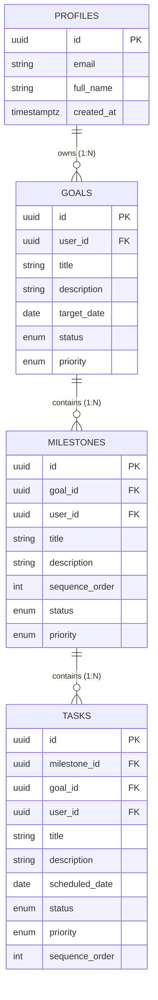
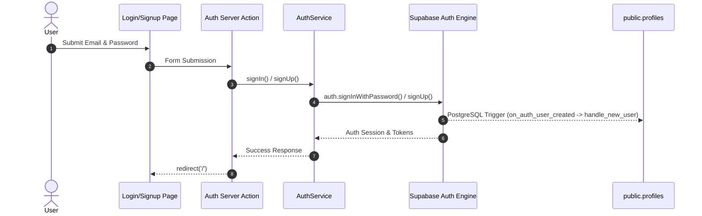
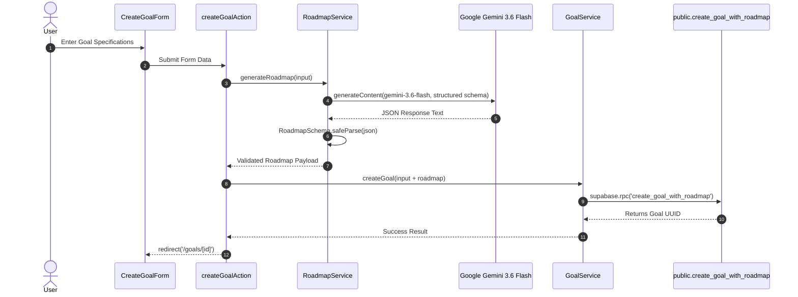
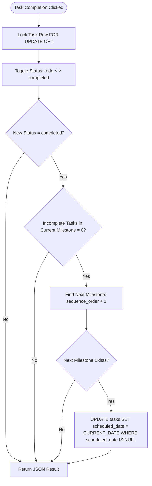

# System Architecture Specification — Stride

> **Status:** Active Implementation Architecture (v0.1)  
> **Audience:** Core Developers, System Architects, AI Execution Agents

---

## 1. System Overview

Stride is an AI-powered goal execution platform designed to transform high-level personal and professional objectives into structured, sequential execution roadmaps and daily action plans.

Unlike traditional task managers that require manual organization and scheduling, Stride operates as an **AI Execution Engine**:
- **Goal Intake**: Users input a high-level goal title, optional description, target date, and priority level.
- **AI Roadmap Generation**: Google Gemini 3.6 Flash (`@google/genai`) breaks the goal into 3–6 sequential milestones, each containing 2–5 beginner-friendly action tasks (5–15 minute execution steps).
- **Atomic Persistence**: Stride persists the goal, milestones, and tasks in PostgreSQL inside Supabase using a transactional stored procedure (`public.create_goal_with_roadmap`).
- **Milestone-Based Daily Focus**: Only Milestone 1 tasks are initially scheduled for `CURRENT_DATE`. Tasks for Milestones 2+ remain unscheduled (`scheduled_date = NULL`).
- **Automatic Progression**: Toggling tasks to completed triggers the PostgreSQL stored procedure `public.toggle_task_and_advance_milestone`. When all tasks in Milestone N are completed, Milestone N+1 tasks automatically receive `scheduled_date = CURRENT_DATE`.

```mermaid
flowchart TD
    User([Authenticated User]) -->|1. Form Submission| Action[createGoalAction]
    Action -->|2. Prompt Engine| Gemini[Google Gemini 3.6 Flash]
    Gemini -->|3. Structured JSON + Zod| Roadmap[Validated Roadmap Payload]
    Action -->|4. RPC Invoke| RPC[public.create_goal_with_roadmap]
    RPC -->|5. Atomic Transaction| DB[(Supabase PostgreSQL)]
    DB -->|6. Redirect| Detail[/goals/id Goal Detail & RoadmapTree]
    User -->|7. Daily Execution| Dashboard[/ Dashboard & TaskList]
    Dashboard -->|8. Task Toggle| ToggleAction[toggleTaskAction]
    ToggleAction -->|9. Progression RPC| ProgRPC[public.toggle_task_and_advance_milestone]
    ProgRPC -->|10. Auto Schedule| DB
```

---

## 2. Repository Structure

```text
Stride/
├── AGENTS.md                  # Repository-wide instructions for AI coding agents
├── CHANGELOG.md               # Reverse-chronological project history & release log
├── LICENSE                    # MIT License
├── README.md                  # Public GitHub project overview & getting started guide
├── app/                       # Next.js 16.3.0 App Router application root
│   ├── AGENTS.md              # Next.js 16 framework agent rules (auto-maintained)
│   ├── components.json        # shadcn/ui component configuration
│   ├── next.config.ts         # Next.js build & Turbopack configuration
│   ├── package.json           # Dependencies (@google/genai, @supabase/ssr, zod, tailwindcss)
│   ├── pnpm-workspace.yaml    # pnpm build script permissions
│   ├── public/                # Static favicon assets
│   └── src/
│       ├── app/               # App Router pages, layouts, & Server Actions
│       │   ├── (auth)/        # Login and Signup routes & auth actions
│       │   ├── goals/         # Goal routes (/goals/new, /goals/[id]) & actions.ts
│       │   ├── globals.css    # Tailwind CSS v4 styling rules
│       │   ├── layout.tsx     # Root HTML layout container
│       │   ├── middleware.ts   # Supabase Auth session refresh middleware
│       │   └── page.tsx       # Root Dashboard page (Today's Focus & Active Goals)
│       ├── components/        # UI Presentation components
│       │   ├── goals/         # CreateGoalForm, RoadmapTree, DeleteGoalDangerZone
│       │   ├── layout/        # UserNav header component
│       │   └── tasks/         # TaskList, TaskItem
│       ├── lib/               # Utility modules & Supabase client factories
│       │   ├── supabase/      # client.ts, server.ts, middleware.ts
│       │   └── utils.ts       # cn() Tailwind class merging utility
│       ├── services/          # Domain Business Logic Layer
│       │   ├── auth.service.ts
│       │   ├── goal.service.ts
│       │   ├── roadmap.service.ts
│       │   └── task.service.ts
│       └── types/             # Domain DTO & Entity Interfaces (index.ts)
├── database/                  # Database architecture & SQL scripts
│   ├── migrations/            # Timestamped PostgreSQL migration scripts
│   └── schemas/               # Idempotent baseline table schemas (00-05)
├── docs/                      # Core System Specifications & Documentation
│   ├── architecture-decisions.md  # Architecture Decision Records (ADRs)
│   ├── database_schema.md         # Active Database Baseline & Policy Specification
│   ├── engineering-principles.md  # Core Engineering Rules & Zero-Bloat Philosophy
│   ├── erd.md                     # Entity Relationship Diagram & Foreign Key Specs
│   ├── error-philosophy.md        # Normalized Error & Safety Guidelines
│   ├── project.md                 # Product Vision & Versioned Scope Matrix
│   └── system-architecture.md     # System Architecture & Technical Specification (This File)
└── design/                    # UI/UX Mockups & Design Assets
```

---

## 3. Application Architecture

Stride follows a **layered, server-first architecture** with strict unidirectional data flow:

```text
Presentation Layer (RSC Pages & Client Components)
        │
        ▼
Server Actions Layer (createGoalAction, toggleTaskAction, deleteGoalAction)
        │
        ▼
Domain Service Layer (GoalService, TaskService, RoadmapService, AuthService)
        │
        ├──► External AI API (Google Gemini 3.6 Flash via @google/genai)
        │
        ▼
Database / Persistence Layer (Supabase PostgreSQL via @supabase/ssr)
```

---

## 4. Next.js App Router Architecture

Stride leverages Next.js 16.3.0 App Router with Turbopack bundler:

- **Root Layout (`app/src/app/layout.tsx`)**: Establishes global dark theme (`bg-black text-zinc-100`), font configuration, and page metadata.
- **Authentication Route Group (`app/src/app/(auth)/`)**: Contains `/login` and `/signup` routes for user authentication.
- **Goal Routes (`app/src/app/goals/`)**:
  - `/goals/new`: Server Component rendering `CreateGoalForm`.
  - `/goals/[id]`: Dynamic Server Component fetching goal detail via `GoalService.getGoal(id)` and rendering `RoadmapTree` and `DeleteGoalDangerZone`.
- **Root Dashboard (`app/src/app/page.tsx`)**: Server Component fetching today's tasks (`TaskService.getTodayTasks()`) and active goals (`GoalService.getGoals()`).

---

## 5. Server Components vs Client Components

Stride enforces strict boundary separation between Server Components and Client Components:

| Component | Type | Responsibility |
|---|---|---|
| `DashboardPage` (`page.tsx`) | **Server Component** | Async data fetching, auth verification, server rendering |
| `GoalDetailPage` (`[id]/page.tsx`) | **Server Component** | Async goal & roadmap fetching, dynamic metadata |
| `NewGoalPage` (`new/page.tsx`) | **Server Component** | Page layout container for goal creation form |
| `UserNav` | **Server Component** | Authenticated user header & signout trigger |
| `RoadmapTree` | **Server Component** | Roadmap visualization rendering milestones & nested tasks |
| `TaskList` | **Server Component** | Groups today tasks by goal into compact cards |
| `CreateGoalForm` | **Client Component** (`'use client'`) | Form inputs, pending state (`useActionState`), error alerts |
| `TaskItem` | **Client Component** (`'use client'`) | Checkbox toggle interaction, pending spinner (`useTransition`) |
| `DeleteGoalDangerZone` | **Client Component** (`'use client'`) | Danger Zone container, 2-step confirmation modal dialog |

---

## 6. Server Actions

Server Actions in `app/src/app/goals/actions.ts` and `app/src/app/(auth)/actions.ts` provide secure, type-safe data mutation boundaries:

1. **`createGoalAction(_prevState, formData)`**:
   - Validates form input (`title`, `description`, `targetDate`, `priority`).
   - Invokes `RoadmapService.generateRoadmap()` to obtain AI roadmap.
   - Invokes `GoalService.createGoal()` to store goal atomically in PostgreSQL.
   - Executes `revalidatePath('/', 'layout')` and redirects to `/goals/[id]`.
2. **`toggleTaskAction(taskId)`**:
   - Validates string `taskId`.
   - Invokes `TaskService.toggleTask(taskId)` (calling RPC `toggle_task_and_advance_milestone`).
   - Executes `revalidatePath('/', 'layout')`.
3. **`deleteGoalAction(goalId)`**:
   - Validates string `goalId`.
   - Invokes `GoalService.deleteGoal(goalId)`.
   - Executes `revalidatePath('/', 'layout')` and redirects to `/`.

---

## 7. Service Layer

The domain service layer (`app/src/services/`) encapsulates all database interactions and third-party API integrations:

- **`AuthService` (`auth.service.ts`)**: Manages session retrieval (`getUser()`), user registration (`signUp()`), login (`signIn()`), signout (`signOut()`), and profile fetching (`getProfile()`).
- **`RoadmapService` (`roadmap.service.ts`)**: Instantiates `GoogleGenAI({ apiKey })` with server-only key `process.env.GEMINI_API_KEY`. Executes model `gemini-3.6-flash` with structured `responseSchema` and validates output using `RoadmapSchema` (Zod).
- **`GoalService` (`goal.service.ts`)**:
  - `createGoal(input)`: Invokes RPC `create_goal_with_roadmap`.
  - `getGoal(id)`: Fetches goal with nested milestones and tasks, sorting tasks explicitly by `sequence_order ASC`.
  - `getGoals()`: Fetches user goals ordered by `created_at DESC`.
  - `deleteGoal(goalId)`: Executes single-row deletion on `goals` table protected by RLS.
- **`TaskService` (`task.service.ts`)**:
  - `getTodayTasks()`: Queries tasks where `scheduled_date = 'today'`, fetches parent goal titles, and sorts tasks deterministically by `(milestone.sequence_order ASC, task.sequence_order ASC, created_at ASC)`.
  - `toggleTask(taskId)`: Invokes RPC `toggle_task_and_advance_milestone`.

---

## 8. Supabase Architecture

Stride connects to Supabase PostgreSQL using `@supabase/ssr` with separate client factories:

- **Server Client (`app/src/lib/supabase/server.ts`)**: Uses Next.js `cookies()` to create an authenticated Supabase server client for Server Components, Server Actions, and services.
- **Browser Client (`app/src/lib/supabase/client.ts`)**: Creates a browser-side client for client-side authentication interactions.
- **Middleware (`app/src/lib/supabase/middleware.ts`)**: Refreshes Supabase auth cookies on incoming HTTP requests.

---

## 9. Database & RLS Architecture

The database schema (`database/schemas/00-05`) consists of 4 primary tables:



### Composite Foreign Keys & RLS
- **Composite Constraints**:
  - `milestones`: `CONSTRAINT fk_milestones_goal_user FOREIGN KEY (goal_id, user_id) REFERENCES public.goals(id, user_id) ON DELETE CASCADE`
  - `tasks`: `CONSTRAINT fk_tasks_milestone_hierarchy FOREIGN KEY (milestone_id, goal_id, user_id) REFERENCES public.milestones(id, goal_id, user_id) ON DELETE CASCADE`
- **RLS Subquery Optimization**: All 15 RLS policies across `profiles`, `goals`, `milestones`, and `tasks` use `(select auth.uid()) = user_id` to eliminate performance advisor initialization warnings.

---

## 10. Authentication Flow



---

## 11. AI Roadmap Generation Flow



---

## 12. Goal $\rightarrow$ Milestone $\rightarrow$ Task Execution Flow

1. **Intake**: User creates goal "Learn Python Programming".
2. **AI Breakdown**: Gemini generates 4 sequential milestones (e.g. Milestone 1: "Set Up Python Environment", Milestone 2: "Control Flow & Functions"...).
3. **Task Breakdown**: Each milestone contains 2–5 beginner tasks (e.g. "Download Python", "Install Visual Studio Code").
4. **Initial Scheduling**: `create_goal_with_roadmap` schedules Milestone 1 tasks to `CURRENT_DATE`. Milestone 2+ tasks receive `scheduled_date = NULL`.
5. **Dashboard Focus**: Dashboard surfaces Milestone 1 tasks under "Today's Focus".
6. **Task Execution**: User checks off Milestone 1 tasks one by one.

---

## 13. Task Scheduling and Milestone Progression

Automatic milestone progression is handled inside PostgreSQL by stored procedure `public.toggle_task_and_advance_milestone(p_task_id UUID)`:



---

## 14. Data Flow

- **Reads**: Server Components (`page.tsx`, `[id]/page.tsx`) call domain services (`GoalService`, `TaskService`) $\rightarrow$ Supabase Server Client $\rightarrow$ PostgreSQL query (filtered by RLS).
- **Mutations**: Client Components (`CreateGoalForm`, `TaskItem`, `DeleteGoalDangerZone`) trigger Server Actions $\rightarrow$ Domain Services $\rightarrow$ Stored Procedures / RLS SQL $\rightarrow$ `revalidatePath('/', 'layout')` $\rightarrow$ Server Component Cache Refresh.

---

## 15. Error Handling Boundaries

Stride enforces normalized, safe error boundaries per `docs/error-philosophy.md`:
- **Server Actions**: Catch exceptions and return clean user-facing error strings `{ error: string }`.
- **Services**: Wrap Supabase and Gemini API calls in `try / catch` blocks. Database internals and raw provider error tracebacks are never exposed to the client.
- **AI Fallback**: If Gemini rate limits or returns invalid JSON, `RoadmapService` returns normalized message `"Our AI execution engine is taking longer than expected. Please try generating your roadmap again."`.
- **404 / Missing Data**: Route `/goals/[id]` triggers Next.js `notFound()` if a goal does not exist or belongs to another user.

---

## 16. Security Boundaries

- **API Keys**: `GEMINI_API_KEY` is server-only (`process.env.GEMINI_API_KEY`). Never prefixed with `NEXT_PUBLIC_` or sent to browser.
- **Database RLS**: Enabled on 100% of tables. Enforces `(select auth.uid()) = user_id`.
- **RPC Privilege Hardening**:
  - Functions use `SECURITY INVOKER` and `SET search_path = ''`.
  - `REVOKE EXECUTE FROM PUBLIC, anon; GRANT EXECUTE TO authenticated;`.
- **Ownership Verification**: Route ID parameters (`/goals/[id]`) are not trusted. RLS filters data by authenticated user session.

---

## 17. Current External Dependencies / Integrations

- **Framework**: Next.js `16.3.0` (App Router, Turbopack)
- **UI & Styling**: React `19.0.0`, Tailwind CSS `v4`, Lucide React icons, `clsx`, `tailwind-merge`
- **Database & Auth**: `@supabase/ssr` `0.5.2`, `@supabase/supabase-js` `2.49.1`
- **AI SDK**: `@google/genai` `2.17.1` (Gemini 3.6 Flash)
- **Validation**: `zod` `4.4.3`

---

## 18. Architectural Constraints

1. **Zero-Bloat Rule**: No Zustand, React Query, Redux, Framer Motion, or external state managers.
2. **Single-User MVP Focus**: Stride v0.1 focuses strictly on single-user goal execution.
3. **No Unsafe Client Mutation**: Mutations flow exclusively through Server Actions and domain services.
4. **No Free-Form AI Execution**: AI output must validate strictly against Zod schemas before persistence.

---

## 19. Future Extension Points (v0.2+)

- **Subtasks & Task Decomposition**: Expanding individual tasks into 3–5 sub-steps.
- **AI Reflections & Adaptations**: Proactive weekly reflection loops to adjust milestone targets.
- **Calendar & Focus Timers**: Calendar integration and integrated execution focus timers.
- **Team Workspaces**: Multi-tenant shared goals and milestone progress tracking.
